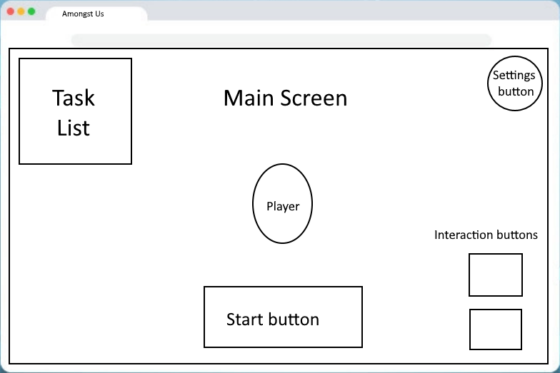

# Background
Amongst Us will be a similar version of the popular Among Us game. It will have a single-player mode and a multi-player mode. The objective of the single-player mode will be to save a ship in outer space from falling apart by completing urgent tasks quickly enough (such as replacing the gas, fixing the alignment, fixing the electric system, etc.). The objective of the multi-player mode is (depending on the role of the player) either for a group of people to expose the players who are impostors before the ship breaks, or for the impostors to sabotage the group for long enough until the ship breaks, without being caught. 

Some of the features involved in this will be allowing an impostor to kill or "knockout" another player, allowing a non-impostor to call a meeting to discuss suspicions (which may involve a chat feature), and creating interfaces for each of the tasks. The user will be able to move around a map, finishing tasks and keeping an eye on other players.

# Functionality & MVPs

In __Amongst Us__, players will be able to:

* Pick a character to use
* Walk around the map using the arrow keys (or WASD keys)
* Complete tasks to save the ship
* Travel through vents for quicker travel [Post MVP]
* Use weapons to fight off enemy aliens [Post MVP]
* Look through security cameras to see other parts of the ship [Post MVP]

In addition, this project will include:
* Instructions on how to play
* README with instructions and more information
* A multiplayer feature [Post MVP 2]
* A chat feature [Post MVP 2]

## First MVP to work on:
Have an initial screen that lets the user initiate a game. User can walk around in the map and not walk through walls. User can walk up to a task area and initiate a task. Once the task is completed successfully, it is registered as complete. Be able to track task completion, and trigger something (a congratulations message or a scene) when all tasks are complete. Have a decent looking map and decent looking characters (at least 1).

# Wireframe

* Will have an initial start page that lets the user begin a game
   * Will include links to this project's Github repo and my LinkedIn
* May be updated to include more features (possible ones are: a minimap, a health bar for the player, an inventory and equipped items screen, and a chat button to open a chat interface)

# Technologies, Libraries, and APIs
Technologies that will be used are the __Canvas API__ in HTML, and of course __JavaScript__ and __Sass__. I may use __[Paint.NET](https://getpaint.net)__ or __Paint__ to create the graphics. I will user __Chrome Dev Tools__ to do a lot of debugging and __VSCode__ to do all the programming. I'll also use __Git__ and __GitHub__ for version control, and __Webpack__ to make organizing my code easier.

# Implementation Timeline
## Thursday
Work on the initial and final proposal, initial analysis and requirements gathering, and design. Work on the README. 

## Friday
Get comfortable with Canvas, understand the basics, and try to set up a skeleton to build off of.

## Saturday
Try to get the core engine of the game going. Get an object to be able to move around a map, and not be able to walk through walls.

## Sunday
Try to implement the functionality for tasks. Let the user initiate a task in various parts of the map. Make an interface show up when a user initiates a task.

## Monday
Work on keeping track of task completion, and work on the event that is triggered when the user completes all tasks successfully. ("Hooray, you saved the ship from breaking down in the middle of outer space!!")

## Tuesday
Work on finishing touches, including map graphics and character graphics.

## Wednesday
Work on finishing touches, including map graphics and character graphics. Work on deploying it.

## Thursday
Work on deploying the project.

# Bonus Features
If I get the opportunity, I would love to implement a fully functional multi-player mode that allows multiple people to play together through the internet and chat through a chatbox. I would also like to add an aliens feature, where aliens may attack and the user would need to use weapons/shields to fight them off. Those weapons/shields would also be usable by impostors and crewmates against each other. Also, a vent system where a user could travel through vents to get around the map quicker.
